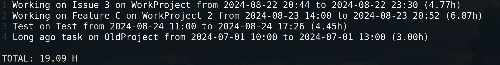
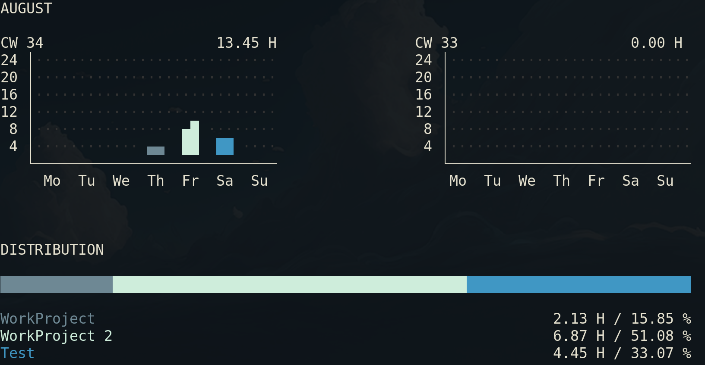
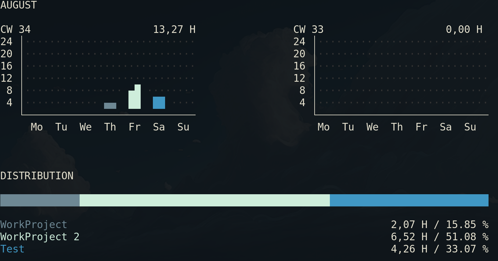

### Info 
  
This is a fork of the 'zeit' repo which can be found [here](https://github.com/mrusme/zeit/)

Much thanks to Mrusme for his work and for making it available to the public.   
I have decided to fork it as I wanted to have some additions and be able to use this accorss different PC's.  
Sadly my setup even with changes did not work with the requiered '.editorconfig',so I couldn't contribute upstream. 

The original repo also has some extras inside that might be interesting to some people.  

> **[Jump to the original project](https://github.com/mrusme/zeit)**

--- 
---

Table of contents: 

- [What?](#What-is-this)
- [Changes to know](#changes-to-know)
- [How to build/install](#building)
- [Usage](#usage)
- [Issues](#Issues)

## What is this?

This project is a `cli` that allows you to track how much time you spend on a given task on a given project.
You can export the statistics to a CSV, display them in the Terminal via a nice statistics screen, or just list them out.


## Changes to know

I just realeased the `v0.2.0`, you can head over there to read about the changes too. 
[Read the release](https://github.com/MaximilianSoerenPollak/zeit/releases/tag/v.0.2.0)

Here are some changes I have made to my fork, that you should be aware of if you use this one.  

#### V0.2.0 Changes 
- Change to SQLITE3 Database 
- Able to import 'zeit' or 'csv' outputs
- Remove 'tyme' completely (from import & export)
- Removed some commands to streamline the Process 
- Added 'colors' to the 'stats' page
- Changed README to include examples and new screenshots
- Removed Git/hub linking feature 
- Made the 'decimal' flag the default everywhere

#### V0.1.0 Changes
- Removed 'extras' as I had no need for them 
- Changed Go Version to 1.22.3 (to make use of new Bugfixes etc.)
- Implemented standard 'GoFmt' formatting 
- Changed 'default' arguments for exporting and added options to it.


### Building
You can build the project by using the 'makefile' or by just using go itself. 
```sh
make VERSION=0.2.0 # to make the newest version.
```
or via go 
```sh 
go build zeit.go  #This however makes it so the 'version' command is not set 
```
After you just have to move the `zeit` binary to into your 'PATH' in order to just use it as `zeit` from anywhere.  
You can accomplish this by moving the binary to `/bin/`.   
If you rather would just the user have execute this binary you can also make a `bin` folder in your home directory and add the zeit binary in there and add the folder to path with adding this to the *.bashrc* or your shells config file  
`export PATH="$PATH:/usr/local/bin"`

### Usage 
Lines that start with `#` inside the commands show you what the output looks like.  

#### Basic Time tracking

Start tracking:  
```sh 
zeit track --task "Working on Issue 3" --project "WorkProject" 
#Started tracking --> Task: Working on Issue 3 on Project: WorkProject 
```
Finish tracking: 
```sh 
zeit finish
# ■ finished tracking Woorking on Issue 3 on WorkProject for 2,07h
```

You can also add 'notes' to the task with `--notes` right when you start tracking it.
But, you can also add notes later like this:
```sh 
zeit entry --notes "Estimate time: 5h" 1
# ● 1
#   Working on Issue 3 on WorkProject
#   2,07h from 2024-08-22 20:44 to 2024-08-22 22:51 
#
#   Notes:
#   Estimate time: 5h
```
>Note: The `1` at the end is the 'id' of the entry. You can find this by doing `zeit list`. The ID is the number before the entry you wish to change.   
>Example of `zeit list` output.  
><br>
>

#### Show all the entries

You can show all entries via `list`, find out about all flags via `zeit list --help`
```sh 
zeit list 
#1 Working on Issue 3 on WorkProject from 2024-08-22 20:44 to 2024-08-22 23:30 (4.77h)
#2 Working on Feature C on WorkProject 2 from 2024-08-23 14:00 to 2024-08-23 20:52 (6.87h)
#3 Test on Test from 2024-08-24 11:00 to 2024-08-24 17:26 (4.45h)
#4 Long ago task on OldProject from 2024-07-01 10:00 to 2024-07-01 13:00 (3.00h)
```
But you can also just let it show the relations between tasks and projects via `--only-projects-and-tasks`

```sh
zeit list --only-projects-and-tasks
# ◆ OldProject
# └── Long ago task
# ◆ WorkProject
# └── Working on Issue 3
# ◆ WorkProject 2
# └── Working on Feature C
# ◆ Test
# └── Test
```

#### Look at Stats
Zeit allows you to display your stats as well, right in your terminal. It colors the projects in 4 rotating colors, to make it easier to disginguish (if your terminal supports colours).  
Zeit will always display the last two weeks (in the calendar view up top), but will list all entry if you have not given it any filters
```sh
zeit stats
```
> 6.87h => 6 hours and 87% of another hour. So (87% of 60 ==> 52min).

  


With the `--decimal=false` flag you can change the decimal behaviour.
```sh 
zeit stats --decimal=false 
```
> 6.52h => 6 hours and 52 Minutes  




#### Export to CSV 
I have added the option to allow `zeit` to also export to 'csv'. Currently it will use `;` as a seperator.
If you do not specify a `--file-name` zeit will use `zeit-export-{yyyy-mm-dd}.csv` as the default file name.
```sh 
$ zeit export --format "csv" 
# ● No file-name provided. Using 'zeit-output-2024-08-24.csv' as default.
# ■ export finished.
```
> If you want to export it, for later import (on a different machine or so) make sure 
> to use the `--export-all-fields` flag. 

The `--export-all-fields` flag, **adds** the **'Begin, Finish & Notes'** fields to the csv export.
For now this only works with the '--format "csv"' and not with 'zeit'. As the zeit format exports all fields by default.


#### Change an entry 

In zeit it's possible to change entries. This can be done via the `entry` command. 
For example, let's change the end time for one of our entries.
```sh 
zeit entry --finish "2024-08-22 23:30" 1
# ● 1
#   Working on Issue 3 on WorkProject
#   4.77h from 2024-08-22 20:44 to 2024-08-22 23:30
#
#   Notes:
#   Estimate time: 5h
```
We can obviously change anything about the project, `--task`, `--being`, `--notes`, `--task`, `--project`, `--finish`  
Find out more via the `--help` command.

### Issues 
If you find issues or bugs, by all means please open an issue with a description and I will take a look at it as soon as I can. 
